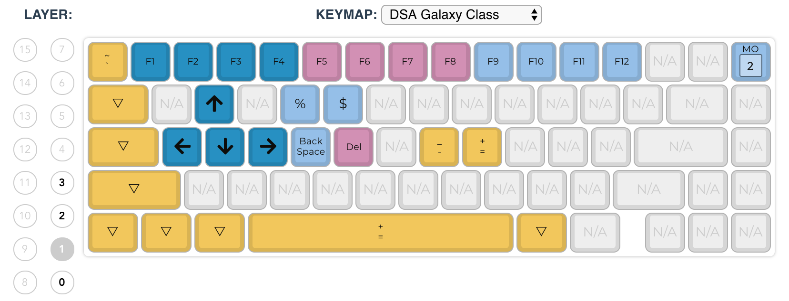
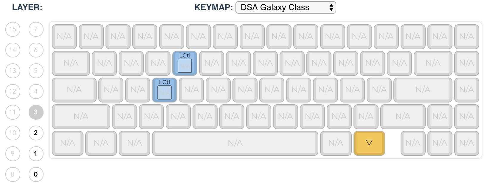

# Keymap







# How to?

**Remember to enable keyboard selection after flashing firmware in [Karabiner app](https://github.com/404pilot/.dotfiles/blob/master/karabiner/karabiner.json)**

1. Configure custom keymap on https://config.qmk.fm/#/whitefox/LAYOUT_truefox and download the json file

2. generate `keymap.c`

   1. `groovy GenerateKeymap.groovy <keymap.json>` to generate the template

   2. modify any keys (some keys cannot be put in web configurator)

      > You can also chain them, for example `LCTL(LALT(KC_DEL))` makes a key that sends Control+Alt+Delete with a single keypress.

   3. use `KC_TRNS` to pass **all modifiers** through to enable combinations like`fn(1) + w + command`

3. build firmware

   https://docs.qmk.fm/#/newbs_building_firmware

   ```shell
   $ cd qmk_firmware
   
   $ util/qmk_install.sh
   
   $ make whitefox:404pilot
   ```

4. find the keyboard

   ```shell
   $ dfu-util --list
   
   dfu-util 0.9
   
   Copyright 2005-2009 Weston Schmidt, Harald Welte and OpenMoko Inc.
   Copyright 2010-2016 Tormod Volden and Stefan Schmidt
   This program is Free Software and has ABSOLUTELY NO WARRANTY
   Please report bugs to http://sourceforge.net/p/dfu-util/tickets/
   
   Found Runtime: [05ac:8290] ver=0167, devnum=6, cfg=1, intf=5, path="20-8", alt=0, name="UNKNOWN", serial="UNKNOWN"
   Found DFU: [1c11:b007] ver=0000, devnum=22, cfg=1, intf=0, path="20-1.1", alt=0, name="Kiibohd DFU", serial="mk20dx256vlh7"
   ```

5. flash the firmware to keyboard

   ```shell
   $ dfu-util -D whitefox_404pilot.bin -d 1c11:b007
   dfu-util 0.9
   
   Copyright 2005-2009 Weston Schmidt, Harald Welte and OpenMoko Inc.
   Copyright 2010-2016 Tormod Volden and Stefan Schmidt
   This program is Free Software and has ABSOLUTELY NO WARRANTY
   Please report bugs to http://sourceforge.net/p/dfu-util/tickets/
   
   dfu-util: Invalid DFU suffix signature
   dfu-util: A valid DFU suffix will be required in a future dfu-util release!!!
   Opening DFU capable USB device...
   ID 1c11:b007
   Run-time device DFU version 0110
   Claiming USB DFU Interface...
   Setting Alternate Setting #0 ...
   Determining device status: state = dfuIDLE, status = 0
   dfuIDLE, continuing
   DFU mode device DFU version 0110
   Device returned transfer size 1024
   Copying data from PC to DFU device
   Download	[=========================] 100%        36780 bytes
   Download done.
   state(7) = dfuMANIFEST, status(0) = No error condition is present
   dfu-util: unable to read DFU status after completion
   ```

